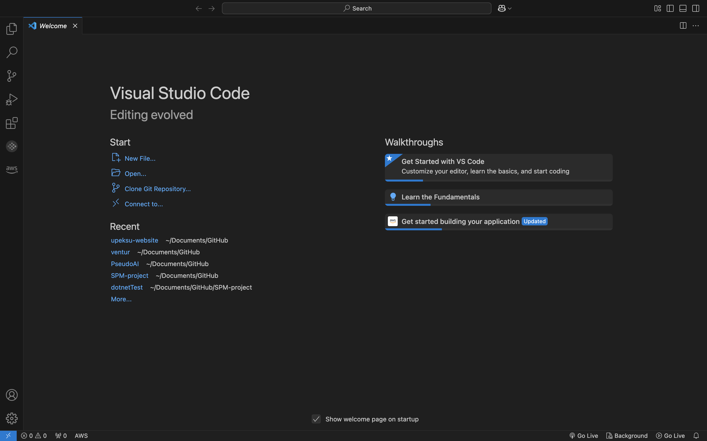
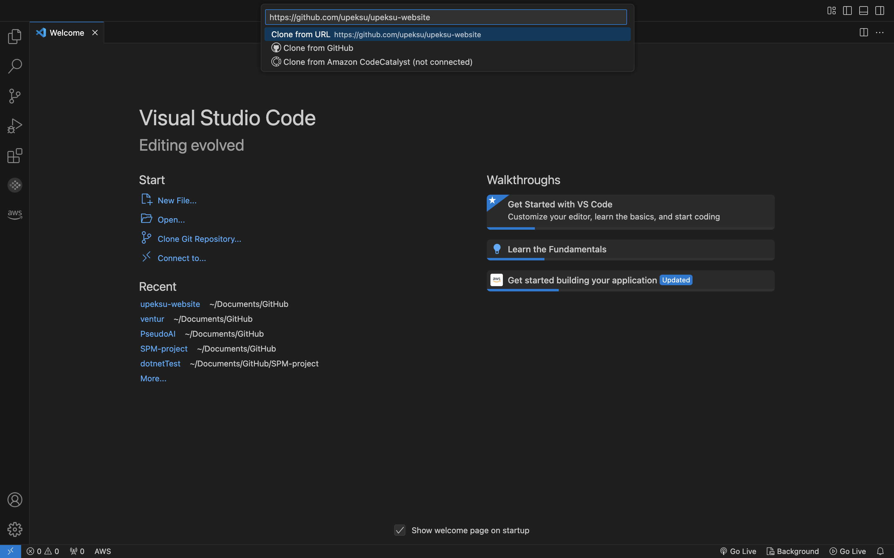
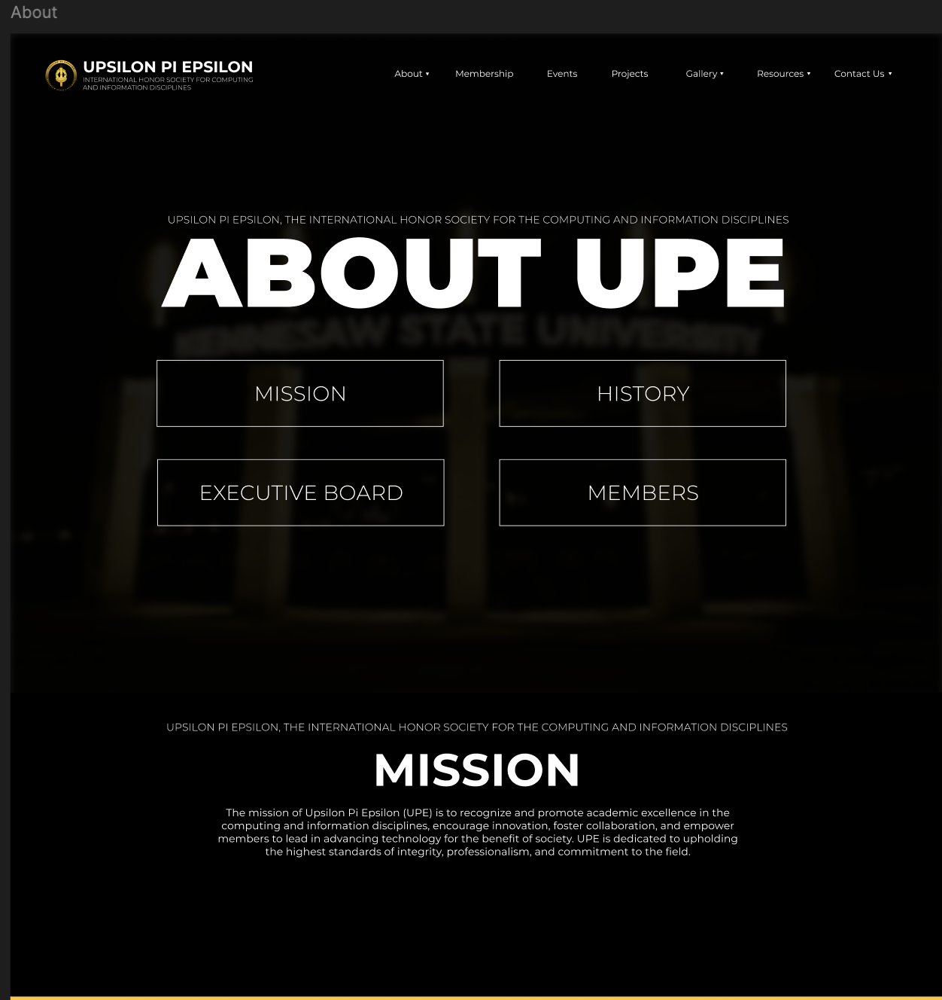
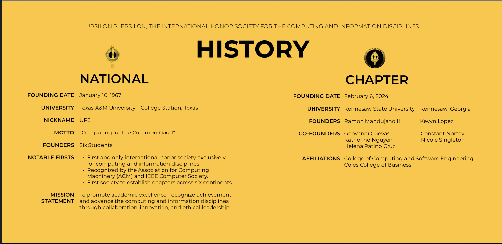
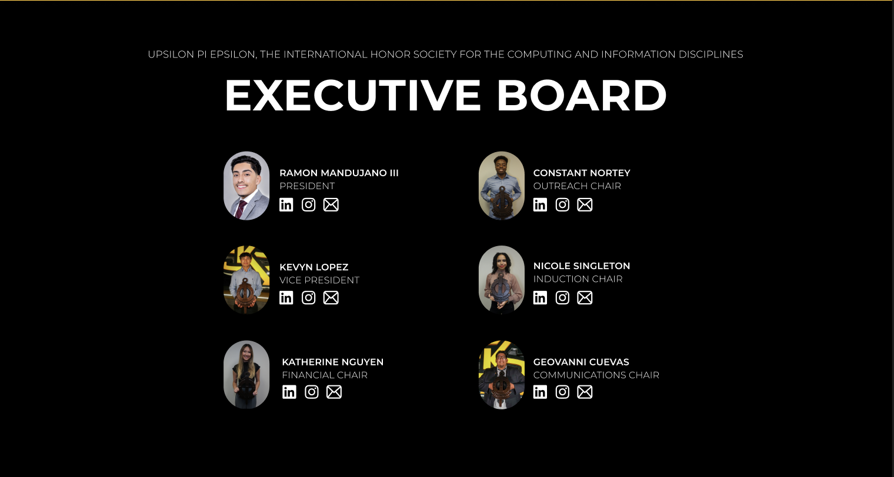
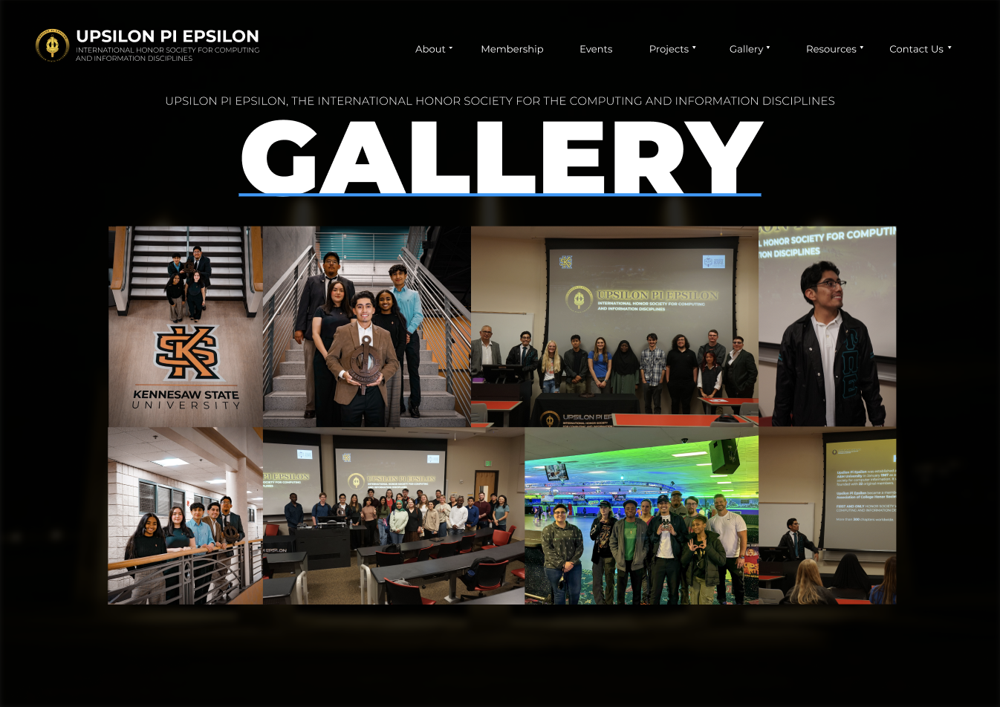
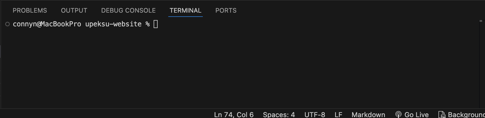
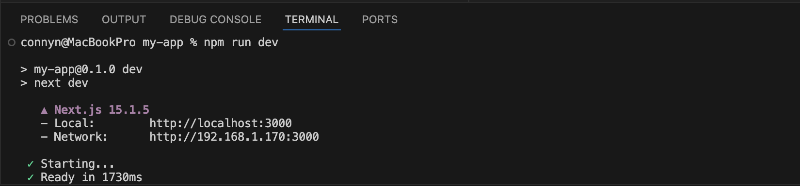

# Welcome to the UPE KSU Website Project! 
Thiss repository contains documentation and code for developing the upeksu website, representing the UPE chapter at Kennesaw State University. The site will highlight our chapter's mission, events, and membership details while engaging current and prospective members.

Currently live at : https://upeksu-website.vercel.app/

## Table of Contents
- [Overview](#overview)
    - [Project Goals](#project-goals)
    - [Team](#team)
    - [Technology](#technology)
    - [Contact](#contact)
- [How to Setup Repository on Local Device](#how-to-setup-repository-on-local-device)
- [Teams](#teams)
- [Running the Web Application](#running-the-web-application)

# Overview

## Project Goals
* Build a professional and user-friendly website for UPE KSU
* Showcase the chapter's mission, events, and membership opportunities.
* Provide a centralized hub for communication and engagement
## Team
This project is being led by the board members of the UPE chapter at Kennesaw State University. Here are the Team leads and roles:
### Project Lead: Kevyn Lopez
### Management / Product Manager: Alondra Sanchez

### Fullstack Lead: Constant Nortey

  
## Technology
This website has been built so far using [NEXT.js](https://nextjs.org/docs) click to see documentation if you want to understand how it works or need to look up how something works.
## Contact
For any questions or feedback, please reach out to:
* Project Lead: Kevyn Lopez
* Team Leads: Constant Nortey and Alondra Sanchez
* UPE@KSU: upe.kennesaw@gmail.com

# How to Setup Repository on Local Device
1. Download and Install Visual Studio Code. [Click to Download](https://code.visualstudio.com/download)
2. Copy this link: https://github.com/upeksu/upeksu-website
3. If you do not have Git installed on your device, click on [this](https://git-scm.com/downloads) to install Git before proceeding

4. Open Visual Studio Code once downloaded, should look like this

5. Click on "**Clone Git Repository**"
6. Paste the copied link from step two as shown below

7. Press `Enter` (Windows) or `return`(MAC) and select where you want to keep the cloned repository.

# Teams
#### Work Style
You are all free to work at your own pace, meaning meet as frequent as you would like. When it comes to coding, depending on how many screens you have, you can pair code.  
This means for instance two people can work one screen and code towards the same .js file
   
The website must be ***responsive*** on mobile. Another way to work is have someone research into the best way to implement a responsive UI on all screens while the other codes the found solution
### About Page
#### Screens
Screen 1

Screen 2

Screen 3

Members
- Geshlee Ruiz
- James B.
- Lucio Almarez
- Kris Prasad
- Mikayla Haigh

### Events Page
Though this page as a single screen, I would recommend crative ways of making the page more interactive and visually pleasing. This does not mean change the UPE background but besides the calendar, what else can be shown on this page?

**The Calendar should be from Google and there are few ways to implement it. Please reach out to Constant, Alondra or Kevyn if you need clarity on this
#### Screen

#### Members
- Alyssa Payong
- Aryan Merchant
- Cameron Taylor
- Olivia Louise Amato

### Gallery Page
Same outline from Events team applies here, find react ways to implement the gallery page. I good suggestion is to make it a carousel. This will allow users to go through pictues indidually instead of multiple in their face at once.   Please reach out to Constant, Alondra or Kevyn if you need clarity on this or want to discuss ideas
#### Screen

#### Members
- Dante Galvan
- Aidan Schmeck
- Rohit Malik 
- Connor Whelan

# Running the Web Application
1. Once you are done cloning the repository on your device and open it in your IDE (Visual Studio is recommended),

2. Click on `Terminal` located on the top left area of the screen. You should see a menu pop up. From the options,
3. Please select `New Terminal`. A new terminal will appear at the botton part of your screen and should look like
this.

This indicates we are in the root folder which should be the name of the repository.

4. Click in the terminal and type `cd my-app`

5. After, type `npm install` to make sure all dependencies are installed

6. Finally, to run in developer mode, type `npm run dev` to load the website locally and see live changes you make.

In this example, I can view the current website using the Local host 3000 shown in the image. You can copy the link and paste in your browser or hold CTRL (Windows) / COMMAND (MAC) and click on the link to view.

