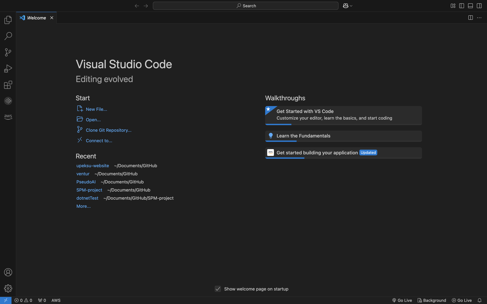
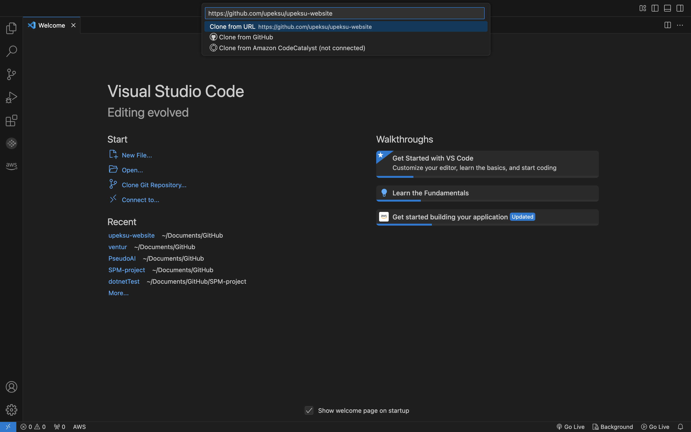
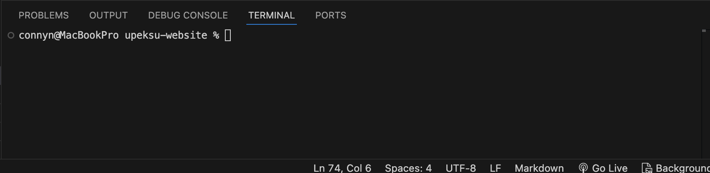
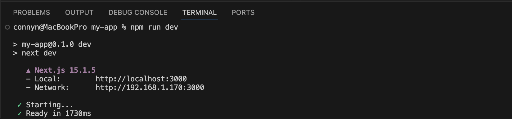

# Welcome to the UPE KSU Website Project!
This repository contains documentation and code for developing the upeksu website, representing the UPE chapter at Kennesaw State University. The site will highlight our chapter's mission, events, and membership details while engaging current and prospective members.

Currently live at : https://upeksu-website.vercel.app/

## Project Goals
* Build a professional and user-friendly website for UPE KSU
* Showcase the chapter's mission, events, and membership opportunities.
* Provide a centralized hub for communication and engagement
## Team
This project is being led by the board members of the UPE chapter at Kennesaw State University. Here are the Team leads and roles:
### Project Lead: Kevyn Lopez
### Frontend Team Lead: Geovanni Cuevas
Members:
### Backend Team Lead: Constant Nortey
Members:
## Getting Started
- Once development begins, this section will include instructions for setting up the project locally.
## Contributing
...
* test 1
* test 2
## Contact
For any questions or feedback, please reach out to:
* Project Lead: Kevyn Lopez
* Team Leads: Constant Nortey and Alondra Sanchez
* UPE@KSU: upe.kennesaw@gmail.com

## Table of Contents
- [How to Setup Repository on Local Device](#how-to-setup-repository-on-local-device)
- [Teams](#teams)
- [Running the Web Application](#running-the-web-application)

# How to Setup Repository on Local Device
1. Download and Install Visual Studio Code. [Click to Download](https://code.visualstudio.com/download)
2. Copy this link: https://github.com/upeksu/upeksu-website
3. If you do not have Git installed on your device, click on [this](https://git-scm.com/downloads) to install Git before proceeding

4. Open Visual Studio Code once downloaded, should look like this

5. Click on "**Clone Git Repository**"
6. Paste the copied link from step two as shown below

7. Press `Enter` (Windows) or `return`(MAC) and select where you want to keep the cloned repository.

# Teams
### About Page
- Geshlee Ruiz
- James B.
- Lucio Almarez
- Nevaeh Branham
- Kris Prasad

### Membership Page
- Mikayla Haigh
- Liam Mason 
- Malavika Balamurali

### Events Page
- Alyssa Payong
- Aryan Merchant
- Cameron Taylor
- Olivia Louise Amato

### Gallery Page
- Dante Galvan
- Aidan Schmeck
- Rohit Malik 
- Connor Whelan

# Running the Web Application
1. Once you are done cloning the repository on your device and open it in your IDE (Visual Studio is recommended),

2. Click on `Terminal` located on the top left area of the screen. You should see a menu pop up. From the options,
3. Please select `New Terminal`. A new terminal will appear at the botton part of your screen and should look like
this.

This indicates we are in the root folder which should be the name of the repository.

4. Click in the terminal and type `cd my-app`

5. After, type `npm install` to make sure all dependencies are installed

6. Finally, to run in developer mode, type `npm run dev` to load the website locally and see live changes you make.

In this example, I can view the current website using the Local host 3000 shown in the image. You can copy the link and paste in your browser or hold CTRL (Windows) / COMMAND (MAC) and click on the link to view.

